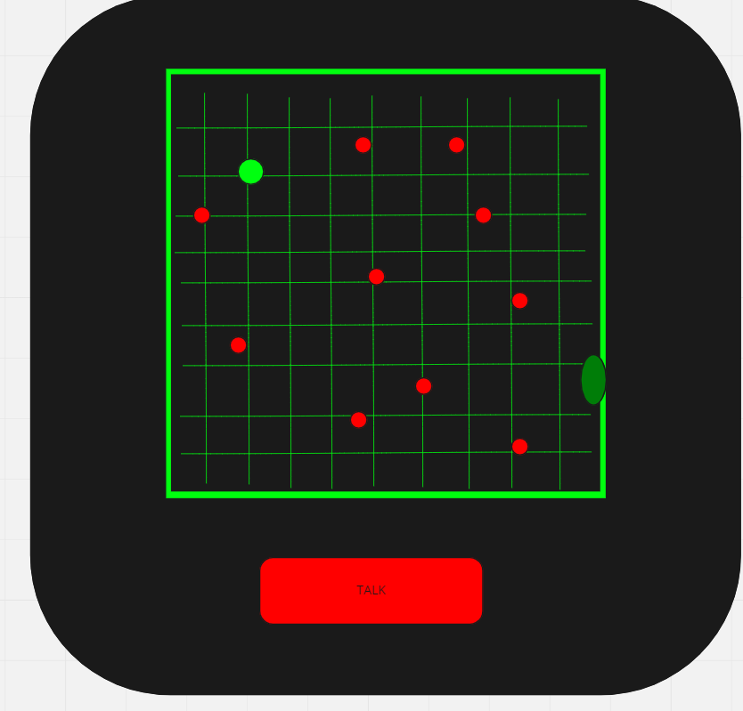
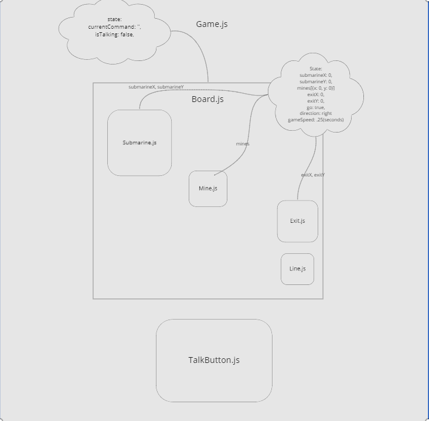

# Guided Expedition Submarine Game 

----- PLAN -----

## GOAL 

Create a game where the user communicates with a blind submarine. They must navigate them manually through a minefield. The submarine will respond to stop, go, up, down, left, right. We will use the tensorflow.js speach command library and access the microphone when the user presses the talk button down.

Game loop: 

User is placed in a random location on the left side of the "map". a number of mines are plaaced randomly across the map. an exit is placed randomly on the right side of the map. the user must navigate the submarine successfully to the exit. if a collision with a mine occurs the game will end. if the user navigates to the exit then a congradulations screen will show and prompt the user to restart.

## File structure

Home ->
    Home.js(introduce player to the game and ask them to begin)
Game ->
    Game.js(contains board and talk button)

    Board ->
        Board.js contains all lines, mines, submarine, and exit

            Submarine ->
                Submarine.js(green dot, moves based on users commands)
            Mine ->
                Mine.js(red dot, static)
            Exit ->
                Exit.js(dark green oval, static)
            Line ->
                Line.js(light green line, placed at intervals of 10 assuming grid of (100,100) ) 
        
    TalkButton ->
        TalkButton.js(Red button, callback function as props)

